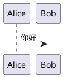

# 使用手册

本文档介绍 QXW 工具集所有命令的详细用法。

## 命令概览

`qxw` 是命令组主入口，内置若干子命令；其余独立命令以 `qxw-*` 形式分布。

### qxw 命令组子命令

| 子命令 | 说明 | 状态 |
|--------|------|------|
| `qxw list` | 列出所有 `qxw-*` 独立命令（不含 qxw 内置子命令） | ✅ 可用 |
| `qxw hello` | 示例命令，验证安装（原 `qxw-hello`） | ✅ 可用 |
| `qxw sbdqf` | 老鼠穿越动画（原 `qxw-sbdqf`） | ✅ 可用 |
| `qxw completion` | 🔑 生成并安装 Shell 补全（原 `qxw-completion`） | ✅ 可用 |

### qxw-* 独立命令

| 命令 | 说明 | 状态 |
|------|------|------|
| `qxw-llm` | 🤖 AI 对话工具集合（对话 / 提供商管理 / TUI） | ✅ 可用 |
| `qxw-serve` | 🌐 HTTP 服务集合（gitbook / webtool / file-web / image-web） | ✅ 可用 |
| `qxw-image` | 📷 图片工具集（RAW 批量转换 / SVG 转 PNG / 调色滤镜 / 自动亮度对比饱和调整 / 元数据擦除） | ✅ 可用 |
| `qxw-markdown` | 📝 Markdown 工具集（PlantUML 渲染 / 公众号适配 / AI 封面生成 / SUMMARY 生成） | ✅ 可用 |
| `qxw-str` | 🔤 字符串工具集（长度统计等） | ✅ 可用 |
| `qxw-math` | 🧮 字符串数学表达式计算（四则 / 次方 / 开方） | ✅ 可用 |

### qxw-serve 子命令

| 子命令 | 说明 |
|--------|------|
| `qxw-serve gitbook` | 📖 Markdown 本地预览（支持单页 / 整本 PDF 下载） |
| `qxw-serve webtool` | 🧰 开发者 Web 工具集（文本对比 / JSON / 时间戳 / 加解密 / 编解码） |
| `qxw-serve file-web` | 📂 HTTP 文件共享（带 Basic Auth 鉴权） |
| `qxw-serve image-web` | 🖼 图片画廊（缩略图 / Live Photo / RAW 预览） |

### qxw-llm 子命令

| 子命令 | 说明 |
|--------|------|
| `qxw-llm chat` | 🗣 与已配置的提供商进行对话（交互式 / 单次） |
| `qxw-llm tui` | 🖥 提供商 TUI 管理界面 |
| `qxw-llm provider list` | 📋 列出所有已配置的提供商 |
| `qxw-llm provider add` | ➕ 添加提供商 |
| `qxw-llm provider show` | 🔎 查看提供商详情 |
| `qxw-llm provider edit` | ✏️ 编辑提供商配置 |
| `qxw-llm provider delete` | 🗑 删除提供商 |
| `qxw-llm provider set-default` | ⭐ 设为默认提供商 |
| `qxw-llm provider ping` | 📡 测试指定提供商连接 |
| `qxw-llm provider ping-all` | 📡 测试所有提供商连接 |

## qxw

QXW 工具集的主命令。作为 Click 命令组承载若干内置子命令（`list` / `hello` / `sbdqf` / `completion`）。

### 基本用法

```bash
qxw                 # 显示帮助（列出子命令）
qxw list            # 列出所有 qxw-* 独立命令（不含 qxw 内置子命令）
qxw <子命令> --help  # 查看子命令详细帮助
```

### 子命令概览

| 子命令 | 说明 |
|--------|------|
| `list` | 列出 QXW 工具集所有 `qxw-*` 独立命令（不含 qxw 内置子命令） |
| `hello` | 示例命令，验证安装 |
| `sbdqf` | 🐭 老鼠穿越动画 |
| `completion` | 🔑 生成 / 安装 / 卸载 Shell 补全脚本 |

### 参数说明

| 参数 | 说明 |
|------|------|
| `--version` | 显示版本号 |
| `--help` | 显示帮助信息 |

### qxw list 输出示例

```
                        QXW 命令列表 (v0.1.0)
┌───────────────────┬────────────────────────────────────────┐
│ 命令              │ 说明                                    │
├───────────────────┼────────────────────────────────────────┤
│ qxw-image         │ QXW 图片工具集（RAW / SVG / 调色滤镜）   │
│ qxw-llm           │ QXW AI 对话工具集合 - 对话 / 提供商管理   │
│ qxw-markdown      │ QXW Markdown 工具集                      │
│ qxw-serve         │ QXW HTTP 服务集合                        │
│ qxw-str           │ QXW 字符串工具集（长度统计等）            │
│ qxw-math          │ QXW 数学表达式计算器                      │
└───────────────────┴────────────────────────────────────────┘
```

> 注：`qxw list` 仅展示通过 `console_scripts` 注册的 `qxw-*` 独立命令，
> 不展示 `qxw` 内置子命令（`list` / `hello` / `sbdqf` / `completion`），
> 后者请通过 `qxw --help` 查看。

## qxw hello

示例命令，用于验证 QXW 工具集安装是否正确。作为 `qxw` 命令组的子命令。

### 环境初始化

首次运行 `qxw hello` 时，会自动检测运行环境是否就绪。如果尚未初始化，将自动完成以下操作：

- 创建配置目录 `~/.config/qxw/`
- 生成配置文件 `~/.config/qxw/setting.json`（基于内置模板）
- 创建日志目录 `~/.config/qxw/logs/`
- 初始化数据库文件 `~/.config/qxw/qxw.db`

后续运行时若环境已就绪，则跳过初始化步骤。

### 基本用法

```bash
# 命令行模式（默认）
qxw hello

# TUI 交互模式
qxw hello --tui
```

### 参数说明

| 参数 | 缩写 | 默认值 | 说明 |
|------|------|--------|------|
| `--name` | `-n` | 世界 | 问候对象的名称 |
| `--tui` | - | false | 启用 TUI 交互模式 |
| `--version` | - | - | 显示版本号 |
| `--help` | - | - | 显示帮助信息 |

### 示例

```bash
# 自定义问候对象
qxw hello --name 开发者

# 查看版本
qxw hello --version

# 查看帮助
qxw hello --help
```

### TUI 界面快捷键

| 快捷键 | 功能 |
|--------|------|
| `Q` | 退出 |
| `D` | 切换暗色/亮色主题 |

## qxw sbdqf

老鼠穿越动画命令，致敬经典的 `sl` 命令。一只 ASCII 老鼠从终端屏幕右边飞速跑到左边。作为 `qxw` 命令组的子命令。

和 `sl` 一样，动画期间 Ctrl+C 无法中断——你必须耐心等待老鼠跑完全程！

### 基本用法

```bash
qxw sbdqf
```

### 参数说明

| 参数 | 缩写 | 默认值 | 说明 |
|------|------|--------|------|
| `--rounds` | `-r` | 1 | 老鼠跑过屏幕的轮次（不填则跑 1 轮） |
| `--duration` | `-d` | 不限 | 动画最长持续时间（秒） |
| `--version` | - | - | 显示版本号 |
| `--help` | - | - | 显示帮助信息 |

### 动画说明

- 一只带大耳朵、胡须和长尾巴的 ASCII 老鼠从右往左穿过屏幕
- 老鼠有奔跑腿部动画和尾巴摆动效果
- 动画期间屏蔽 SIGINT 信号，必须等老鼠跑完
- 老鼠垂直居中显示，自动适配终端宽度

## qxw-llm

QXW AI 对话工具集合，合并自原 `qxw-chat` / `qxw-chat-provider`。通过子命令形式承载对话、提供商管理、TUI 管理界面。

### 子命令一览

| 子命令 | 说明 |
|--------|------|
| `qxw-llm chat` | 🗣 与已配置的提供商进行对话（交互式 / 单次） |
| `qxw-llm tui` | 🖥 提供商 TUI 管理界面（等同于原 `qxw-chat-provider --tui`） |
| `qxw-llm provider list` | 📋 列出所有已配置的提供商 |
| `qxw-llm provider add` | ➕ 添加提供商 |
| `qxw-llm provider show <name>` | 🔎 查看提供商详情 |
| `qxw-llm provider edit <name>` | ✏️ 编辑提供商配置 |
| `qxw-llm provider delete <name>` | 🗑 删除提供商（支持 `-y` 跳过确认） |
| `qxw-llm provider set-default <name>` | ⭐ 将指定提供商设为默认 |
| `qxw-llm provider ping [name]` | 📡 测试提供商连接（不指定则使用默认提供商） |
| `qxw-llm provider ping-all` | 📡 测试所有已配置的提供商连接 |

### qxw-llm tui

```bash
qxw-llm tui
```

启动 TUI 管理界面后可通过快捷键操作：

| 快捷键 | 功能 |
|--------|------|
| `A` | 添加提供商 |
| `E` / `Enter` | 编辑选中的提供商 |
| `C` | 复制选中的提供商 |
| `D` | 删除选中的提供商 |
| `S` | 将选中的提供商设为默认 |
| `Q` | 退出 |

### qxw-llm provider

支持 OpenAI 和 Anthropic 两种提供商类型。

```bash
# 列出所有提供商
qxw-llm provider list

# 添加 OpenAI 提供商
qxw-llm provider add \
  --name my-openai \
  --type openai \
  --base-url https://api.openai.com/v1 \
  --api-key sk-your-key \
  --model gpt-4o \
  --default

# 添加 Anthropic 提供商
qxw-llm provider add \
  --name my-claude \
  --type anthropic \
  --base-url https://api.anthropic.com \
  --api-key sk-ant-your-key \
  --model claude-sonnet-4-20250514

# 查看提供商详情
qxw-llm provider show my-openai

# 编辑提供商
qxw-llm provider edit my-openai --temperature 0.5 --system-prompt "你是一个有帮助的助手"

# 设为默认提供商
qxw-llm provider set-default my-claude

# 删除提供商
qxw-llm provider delete my-openai

# 测试提供商连接（使用默认提供商）
qxw-llm provider ping

# 测试指定提供商连接
qxw-llm provider ping my-openai

# 测试所有提供商连接
qxw-llm provider ping-all
```

#### add 参数说明

| 参数 | 缩写 | 必填 | 默认值 | 说明 |
|------|------|------|--------|------|
| `--name` | `-n` | 是 | - | 提供商名称（唯一标识，不能为空） |
| `--type` | - | 是 | - | 提供商类型：`openai` 或 `anthropic` |
| `--base-url` | `-u` | 是 | - | API 基础地址（不能为空） |
| `--api-key` | `-k` | 是 | - | API 密钥（不能为空） |
| `--model` | `-m` | 是 | - | 默认模型名称（不能为空） |
| `--temperature` | `-t` | 否 | 0.7 | 默认温度参数（范围 `0.0-2.0`） |
| `--max-tokens` | - | 否 | 4096 | 默认最大 token 数（必须为正整数） |
| `--top-p` | - | 否 | 1.0 | 默认 top_p 参数（范围 `0.0-1.0`） |
| `--system-prompt` | `-s` | 否 | (空) | 默认系统提示词 |
| `--default` | - | 否 | false | 设为默认提供商 |

> 📝 `temperature` / `top_p` / `max_tokens` 以及必填字符串字段会在写库前做参数校验；超出范围或为空会抛出 `ValidationError`，不会把非法数据持久化。

### qxw-llm chat

与已配置的 AI 对话提供商进行交互式对话，支持流式输出。

```bash
# 使用默认提供商开始交互式对话
qxw-llm chat

# 指定提供商
qxw-llm chat --provider my-openai

# 覆盖默认参数
qxw-llm chat --model gpt-4o-mini --temperature 0.3

# 单次对话模式（发送一条消息后退出）
qxw-llm chat -m "用 Python 写一个快速排序"

# 指定系统提示词
qxw-llm chat --system "你是一个 Python 专家"
```

#### 参数说明

| 参数 | 缩写 | 默认值 | 说明 |
|------|------|--------|------|
| `--provider` | `-p` | (默认提供商) | 指定提供商名称 |
| `--model` | - | (提供商默认) | 覆盖默认模型 |
| `--temperature` | `-t` | (提供商默认) | 覆盖默认温度参数 |
| `--max-tokens` | - | (提供商默认) | 覆盖默认最大 token 数 |
| `--top-p` | - | (提供商默认) | 覆盖默认 top_p 参数 |
| `--system` | `-s` | (提供商默认) | 覆盖默认系统提示词 |
| `--message` | `-m` | - | 单次对话模式 |

#### 交互式对话命令

| 命令 | 说明 |
|------|------|
| `/exit` | 退出对话 |
| `/clear` | 清空上下文（重新开始对话） |
| `Ctrl+C` | 退出对话 |

## qxw-serve

HTTP 服务集合命令。把原先分散的 `qxw-gitbook serve` / `qxw-webtool` / `qxw-file-server http` / `qxw-image http` 统一到同一个命令组下，暴露为四个子命令。

### 子命令一览

| 子命令 | 说明 |
|--------|------|
| `qxw-serve gitbook` | 📖 Markdown 本地预览（侧边目录树 + 单页 / 整本 PDF 下载按钮） |
| `qxw-serve webtool` | 🧰 开发者 Web 工具集（文本对比 / JSON / 时间戳 / 加解密 / 编解码） |
| `qxw-serve file-web` | 📂 HTTP 文件共享（带 Basic Auth 鉴权，含目录浏览与打包下载） |
| `qxw-serve image-web` | 🖼 图片画廊（缩略图 / Live Photo / RAW 预览） |

> 不再提供 FTP 文件服务。`qxw-gitbook pdf` 本地批量 PDF 功能已删除；如需批量转 PDF，请使用 `qxw-serve gitbook` 后在浏览器里点击"下载整本 PDF"。

### qxw-serve gitbook

启动本地 HTTP 服务预览 Markdown 文件，页面上直接提供 PDF 下载入口：

- 每页右上角 **⬇ 下载本页 PDF** —— 将当前 `.md` 文件渲染为单个 PDF
- 侧边栏顶部 **⬇ 下载整本 PDF** —— 把目录下全部 `.md`（递归）按路径顺序合并为一个 PDF

```bash
qxw-serve gitbook                # 预览当前目录（默认 8000 端口）
qxw-serve gitbook -p 3000        # 指定端口
qxw-serve gitbook -d docs/       # 预览 docs/ 目录
qxw-serve gitbook -H 0.0.0.0     # 允许局域网访问
```

#### 参数说明

| 参数 | 缩写 | 默认值 | 说明 |
|------|------|--------|------|
| `--dir` | `-d` | `.` | Markdown 文件所在目录 |
| `--port` | `-p` | 8000 | 服务端口 |
| `--host` | `-H` | 127.0.0.1 | 监听地址 |

#### PDF 下载的依赖

PDF 下载功能依赖 `weasyprint`。未安装时预览页面仍可正常使用，只有点击 PDF 下载按钮时才会返回 500 错误并提示安装方法：

```bash
# macOS
brew install pango && pip install weasyprint

# Linux (Debian/Ubuntu)
sudo apt install libpango-1.0-0 && pip install weasyprint

# 或一步到位
pip install "qxw[pdf]"
```

### qxw-serve webtool

启动本地开发者 Web 工具集。

```bash
qxw-serve webtool                # 默认 9000 端口
qxw-serve webtool -p 3000        # 指定端口
qxw-serve webtool -H 0.0.0.0     # 允许局域网访问
```

#### 参数说明

| 参数 | 缩写 | 默认值 | 说明 |
|------|------|--------|------|
| `--port` | `-p` | 9000 | 服务端口 |
| `--host` | `-H` | 127.0.0.1 | 监听地址 |

#### 功能列表

##### 文本对比

两段文本的 Unified Diff 差异比较，高亮显示新增（绿色）和删除（红色）行。

##### JSON 格式化

- **格式化**：将 JSON 美化为缩进格式
- **压缩**：将 JSON 压缩为单行
- **校验**：检查 JSON 是否合法
- **转义 / 去转义**：在 JSON 字符串字面量与原始字符串之间互转

##### 时间戳转换

- 实时显示当前 Unix 时间戳
- Unix 时间戳（秒/毫秒）→ 日期时间
- 日期时间 → Unix 时间戳
- 支持格式：`YYYY-MM-DD HH:MM:SS`、`YYYY-MM-DD`、`YYYY/MM/DD` 等

##### 加解密

| 功能 | 算法 | 说明 |
|------|------|------|
| 哈希 | MD5 / SHA1 / SHA256 / SHA512 | 单向哈希计算 |
| HMAC | HMAC-SHA256 / HMAC-SHA512 | 基于密钥的消息认证码 |
| AES | AES-128/192/256（CBC / ECB） | 对称加密，PKCS7 填充，密钥为 Hex 格式 |
| DES | DES（CBC） | 对称加密，8 字节 Hex 密钥 |
| 3DES | 3DES（CBC） | 对称加密，16/24 字节 Hex 密钥 |
| RSA | RSA-2048/4096（OAEP+SHA256） | 非对称加密，支持密钥对生成 |
| Ed25519 | Ed25519 | 非对称签名，支持密钥对生成 / 签名 / 验证 |
| 证书解析 | X.509 PEM / Base64 DER | 解析证书信息（颁发者 / 有效期 / SAN / 指纹等） |

对称加密约定：
- 密钥和 IV 使用 Hex 格式输入
- 加密输出为 Base64（CBC 模式下 IV 前置于密文）
- 解密输入为 Base64（自动提取前置的 IV）

##### URL 编解码 / Base64 编解码

分别提供 URL Encode / Decode 与 Base64 Encode / Decode 转换。

### qxw-serve file-web

通过 HTTP 协议共享目录文件，使用 HTTP Basic Auth 进行鉴权。

```bash
qxw-serve file-web                       # 共享当前目录（8080 端口）
qxw-serve file-web -d /tmp               # 共享 /tmp 目录
qxw-serve file-web -p 9000               # 指定端口
qxw-serve file-web -u user -P mypass     # 指定用户名和密码
qxw-serve file-web -H 0.0.0.0            # 允许局域网访问
```

#### 参数说明

| 参数 | 缩写 | 默认值 | 说明 |
|------|------|--------|------|
| `--dir` | `-d` | `.` | 共享目录路径 |
| `--port` | `-p` | 8080 | 服务端口 |
| `--host` | `-H` | 127.0.0.1 | 监听地址 |
| `--username` | `-u` | admin | 鉴权用户名 |
| `--password` | `-P` | (自动生成) | 鉴权密码，不指定则启动时自动生成随机密码并打印 |

#### 鉴权说明

- 不指定 `--password` 时，每次启动都会生成一个新的随机密码并打印到终端
- 浏览器访问时会弹出 Basic Auth 登录窗口
- 目录列表页支持 **⬇ 下载** 单文件与 **📦 打包下载** 整个子目录（zip 流式生成）

### qxw-serve image-web

启动图片浏览 HTTP 服务，提供缩略图画廊 + 灯箱预览。支持 Live Photo（同目录下同名图片 + 视频）播放以及 RAW 文件预览。

```bash
qxw-serve image-web                           # 浏览当前目录图片
qxw-serve image-web -d ~/Photos               # 指定图片目录
qxw-serve image-web -p 9000                   # 指定端口
qxw-serve image-web -s 300 --thumb-quality 70 # 调整缩略图参数
qxw-serve image-web --no-recursive            # 不递归扫描子目录
```

#### 参数说明

| 参数 | 缩写 | 默认值 | 说明 |
|------|------|--------|------|
| `--dir` | `-d` | `.` | 图片目录路径 |
| `--port` | `-p` | 8080 | 服务端口 |
| `--host` | `-H` | 127.0.0.1 | 监听地址 |
| `--thumb-size` | `-s` | 400 | 缩略图尺寸（像素，范围 `50-4096`） |
| `--thumb-quality` | - | 85 | 缩略图 JPEG 质量 (`1-100`) |
| `--recursive` / `--no-recursive` | `-r` | `--recursive` | 是否递归扫描子目录 |

#### 支持的格式

- 图片：JPG / PNG / GIF / WebP / BMP / TIFF / HEIC
- RAW：CR2 / CR3 / NEF / ARW / DNG / ORF / RW2 / PEF / RAF 等
- Live Photo 关联视频：MOV / MP4

#### 灯箱内的参数调整面板

单击任意图片打开灯箱，点击右上角 **🎚 调整** 即可展开 15 档调节滑块，改动会被 debounce 150ms 后即时渲染到预览上（服务端把底图降采样到最长边 1200px 后再叠加参数，单次调用 ~100ms 级）：

| 参数 | 英文键 | 取值范围 | 说明 |
|------|--------|----------|------|
| 曝光 | `exposure` | -100 – 100 | 线性空间等效 ±2 级曝光补偿 |
| 鲜明度 | `brilliance` | -100 – 100 | 中间调 S 曲线提亮 / 压暗 |
| 高光 | `highlights` | -100 – 100 | 仅作用于 L > 0.5 的软 mask |
| 阴影 | `shadows` | -100 – 100 | 仅作用于 L < 0.5 的软 mask |
| 对比度 | `contrast` | -100 – 100 | 围绕 0.5 的线性伸缩 |
| 亮度 | `brightness` | -100 – 100 | sRGB 空间加偏移 |
| 黑点 | `blacks` | -100 – 100 | 仅作用于最暗 20% 区域 |
| 饱和度 | `saturation` | -100 – 100 | HSV 的 S 通道整体缩放 |
| 自然饱和度 | `vibrance` | -100 – 100 | 低饱和区更敏感、高饱和区抑制 |
| 色温 | `temperature` | -100 – 100 | R+ / B- 交叉偏移（正值偏暖） |
| 色调 | `tint` | -100 – 100 | G 反向偏移（正值偏洋红） |
| 锐度 | `sharpness` | **0 – 100** | 小半径 USM |
| 清晰度 | `clarity` | **0 – 100** | 大半径 USM，增强局部对比 |
| 噪点消除 | `noise_reduction` | **0 – 100** | 整体高斯模糊（最大 σ≈2） |
| 晕影 | `vignette` | -100 – 100 | 径向衰减，正值压暗边缘 |

面板底部提供：

- **重置**：一键把所有滑块回到 0，恢复原图（关闭灯箱也会自动重置）
- **💾 保存原尺寸**：把当前滑块组合以原分辨率重新应用一遍，写到源目录下的 `<原名>_adjusted_<时间戳>.jpg`。成功后底部会弹出绿色 toast 提示保存路径，失败弹红色 toast。至少需要一个滑块不为 0，按钮才可点击。

该面板不依赖额外的前端框架，全部以原生 HTML/JS 实现，降采样预览由 Pillow + NumPy 完成。HTTP 路由：

| 路由 | 方法 | 用途 |
|------|------|------|
| `/adjust/<相对路径>?...` | GET | 返回 1200px 长边降采样的实时预览 JPEG |
| `/save/<相对路径>?...`   | POST | 把调整应用到原尺寸并保存到源目录，返回 JSON `{path, absolute, size}` |

两条路由的参数集合完全相同。非法参数（非数字、越界、未知键）返回 HTTP 400；路径不存在返回 404；PIL / NumPy 缺失或写盘失败返回 500。`/save` 上若所有参数都是 0（`is_identity`），服务端会拒绝并返回 400，避免产生无意义的重编码文件。

## qxw-image

图片工具集，支持将相机 RAW 文件批量转换为 JPG、将 SVG 批量栅格化为同名 PNG、对已有位图批量套用调色滤镜、按预设档位自动调整亮度/对比/饱和度（可选 HDR 观感），以及原地擦除位图的 EXIF/IPTC/XMP/ICC 等元数据。

> 图片画廊 HTTP 服务已迁移至 `qxw-serve image-web`。

### 安装图片处理依赖

```bash
pip install "qxw[image]"
```

这将安装 Pillow（图片处理）、rawpy（用于 RAW 解码和画廊预览）和 cairosvg（SVG 栅格化）。如需 HEIC 格式支持，额外安装：

```bash
pip install pillow-heif
```

### 基本用法

```bash
# 将当前目录 RAW 文件批量转为 JPG（输出到 ./jpg/）
qxw-image raw

# 将当前目录所有 SVG 批量转成同名 PNG（默认递归、2x 缩放、覆盖）
qxw-image svg

# 对已有位图（JPG/PNG 等）套用调色滤镜
qxw-image filter -n fuji-cc -d ~/Photos/exports

# 自动调整亮度 / 对比 / 饱和，输出更"舒服"的观感
qxw-image change -d ~/Photos/exports -i balanced

# 原地擦除位图的 EXIF/IPTC/XMP/ICC 元数据（不可逆，需要二次确认或加 --yes）
qxw-image clear -d ~/Photos/exports --yes
```

### 子命令说明

| 子命令 | 说明 |
|--------|------|
| `raw`    | 将相机导出的 RAW 图片批量转换为 JPG（可选 `--filter` 一步到位调色） |
| `svg`    | 将 SVG 批量栅格化为同目录下的同名 PNG |
| `filter` | 对已有位图（JPG/PNG/TIFF/HEIC 等）批量套用调色滤镜 |
| `change` | 对已有位图按预设档位做自动亮度 / 对比 / 饱和调整（可选 HDR 观感），详见下文 |
| `clear`  | **原地擦除**位图的 EXIF / IPTC / XMP / ICC 等元数据，详见下文 |

### raw 参数说明

| 参数 | 缩写 | 默认值 | 说明 |
|------|------|--------|------|
| `--dir` | `-d` | `.` | RAW 文件所在目录 |
| `--output` | `-o` | `<源目录>/jpg` | 输出目录（保持相对路径结构） |
| `--recursive` | `-r` | false | 是否递归处理子目录 |
| `--quality` | `-q` | 92 | JPEG 压缩质量 (1-100)，仅在 rawpy 解码路径生效 |
| `--overwrite` / `--no-overwrite` | - | `--no-overwrite` | 是否覆盖已存在的输出文件 |
| `--use-embedded` / `--no-use-embedded` | - | `--use-embedded` | 是否优先使用相机内嵌 JPEG 预览 |
| `--fast` | - | false | 快速解码：线性去马赛克 + 半分辨率，仅对 rawpy 解码路径生效（约 8-10x 加速） |
| `--filter` | - | `default` | 调色滤镜插件名；`default` 不调色（不影响 `--use-embedded`），其他值强制走 `--no-use-embedded`，详见下文"调色滤镜"章节 |
| `--workers` | `-j` | `min(CPU核数, 4)` | 并行处理线程数，`-j 1` 表示串行 |

### filter 参数说明

`filter` 子命令对**已有位图**（非 RAW）批量套用调色滤镜。它与 `raw --filter` 共享同一个滤镜插件注册中心（见下文"调色滤镜"章节），但路径不同：

- `raw --filter <name>`：RAW → rawpy 解码 → 调色 → JPEG，**单遍流水线，画质最佳**
- `filter -n <name>`：现有位图 → PIL 解码 → 调色 → JPEG，适合对已经导出的 JPG / 截图 / 手机图批量再处理

| 参数 | 缩写 | 默认值 | 说明 |
|------|------|--------|------|
| `--dir` | `-d` | `.` | 输入目录 |
| `--output` | `-o` | `<源目录>/filtered` | 输出目录（保持相对路径结构） |
| `--recursive` | `-r` | false | 是否递归处理子目录；递归扫描时会自动跳过输出目录下的旧产物，避免把滤镜叠加到自己身上 |
| `--name` | `-n` | - | 调色滤镜名（必填，除非用 `--list`）；不接受 `default`；非法名会列出全部可选名 |
| `--quality` | `-q` | 92 | JPEG 压缩质量 (1-100) |
| `--overwrite` / `--no-overwrite` | - | `--no-overwrite` | 是否覆盖已存在的输出文件 |
| `--workers` | `-j` | `min(CPU核数, 4)` | 并行处理线程数，`-j 1` 表示串行 |
| `--list` | - | false | 列出所有已注册的调色滤镜名后退出（忽略其他参数） |

支持的输入格式：JPG / JPEG / PNG / WebP / BMP / TIFF / HEIC / HEIF。输出统一为 JPG；若要保留 RAW 的最佳画质，请改用 `raw --filter`。

### change 参数说明

`change` 子命令对**已有位图**按预设档位做自动亮度 / 对比 / 饱和调整，目标是"看着舒服"（自然、保留肤色与高光、不出现 neon/halo 伪影），而不是"最大化对比"。

| 参数 | 缩写 | 默认值 | 说明 |
|------|------|--------|------|
| `--dir` | `-d` | `.` | 输入目录 |
| `--output` | `-o` | `<源目录>/changed` | 输出目录（保持相对路径结构） |
| `--recursive` | `-r` | false | 是否递归处理子目录；递归扫描时自动跳过输出目录下的旧产物 |
| `--intensity` | `-i` | `balanced` | 档位预设：`subtle` / `balanced` / `punchy` 之一 |
| `--hdr` / `--no-hdr` | - | `--hdr` | 启用 HDR 局部 tone mapping（base/detail 分解 + 高光压缩 + 细节放大）；**默认开启**，若不想要 HDR 观感传 `--no-hdr` |
| `--preserve-exif` / `--no-preserve-exif` | - | `--preserve-exif` | 是否保留源图 EXIF；orientation tag 会自动清为 1，像素已实际旋转 |
| `--quality` | `-q` | 92 | JPEG 压缩质量 (1-100) |
| `--overwrite` / `--no-overwrite` | - | `--no-overwrite` | 是否覆盖已存在的输出文件 |
| `--workers` | `-j` | `min(CPU核数, 4)` | 并行处理线程数，`-j 1` 表示串行 |

支持的输入格式：JPG / JPEG / PNG / WebP / BMP / TIFF / HEIC / HEIF。输出统一为 JPG。

#### 档位说明

| 档位 | 效果强度 | 典型使用场景 |
|------|---------|--------------|
| `subtle` | 温和 | 本身曝光对比都不错、只想做一次轻度"加分"的片子；参数非常保守 |
| `balanced` | 平衡（默认） | 日常照片 90% 情况下最合适；自动识别暗光分支做针对性提亮 |
| `punchy` | 强烈 | 灰度大、对比低、压缩明显的手机直出或截图；CLAHE 与 vibrance 都更激进 |

#### 算法流水线

1. `sRGB → LAB`，以 L 通道（亮度）为主要处理对象
2. **中位数亮度检测**：若 L 中位数低于档位阈值，切到 IAGCWD-style **暗光分支**（加权 CDF 反函数抬暗部），否则走 **Auto-Levels**（百分位拉伸，Limare et al. 的 Simplest Color Balance 思路）
3. **CLAHE**：L 通道局部对比度增强，clipLimit / tileGrid 按档位取值，避免全局均衡化的"塑料感"
4. **中位数 Gamma**：把处理后的 L 中位数贴近目标值
5. 如果开启 `--hdr`：先对 L 做 Gaussian 低通得到 base 层，在 log-domain 压缩 base 的动态范围、再按系数放大 detail 层合成（Durand-Dorsey lite）
6. `LAB → sRGB → HSV`，计算**肤色软 mask**（H/S/V 三维 smoothstep），做非线性 **Vibrance**（S' = S + (1-S)·boost·weight·activation，低饱和加得多、高饱和几乎不动、肤色区域 boost 打折）
7. `HSV → RGB`，clip 回 uint8

#### EXIF 处理

- 默认保留源图 EXIF。orientation tag (0x0112) 会被重写为 1，因为处理前像素已按原 orientation 做了物理旋转（`ImageOps.exif_transpose`），若不清理会导致查看器再次旋转 → 双重旋转。
- `--no-preserve-exif` 清空所有 EXIF（输出最小化）。

#### 使用示例

```bash
# 当前目录 → ./changed/，默认平衡档 + HDR 默认开启
qxw-image change

# 强力档（HDR 仍默认开启），用于灰度大 / 阴天 / 室内手机直出
qxw-image change -i punchy

# 关闭 HDR，走纯"自动亮度对比饱和"流水线（更保守）
qxw-image change --no-hdr

# 温和档 + 去 EXIF（匿名化）
qxw-image change -i subtle --no-preserve-exif

# 高质量 + 多线程 + 覆盖旧产物
qxw-image change -q 95 -j 8 --overwrite
```

> 不支持 RAW 输入。若需要对 RAW 做"解码 + 自动增强"，当前做法是先跑 `qxw-image raw` 解码成 JPG，再跑 `qxw-image change`。

### clear 参数说明

`clear` 子命令**原地覆盖**源文件，擦除其 EXIF / IPTC / XMP / ICC profile 等容器级元数据，像素数据保留。常见使用场景：发布到公开平台前去掉 GPS / 拍摄设备型号 / 编辑历史 / 版权水印，或者批量"消毒"一组下载图片。

| 参数 | 缩写 | 默认值 | 说明 |
|------|------|--------|------|
| `--dir` | `-d` | `.` | 输入目录 |
| `--recursive` | `-r` | false | 是否递归处理子目录 |
| `--yes` | `-y` | false | 跳过二次确认。**原地覆盖不可逆**，默认会要求用户输入 yes 后再继续 |
| `--workers` | `-j` | `min(CPU核数, 4)` | 并行处理线程数，`-j 1` 表示串行 |

支持的输入格式：JPG / JPEG / PNG / TIFF / TIF / WebP。不支持 HEIC/HEIF（libheif 的 HEIC 编码依赖于带 x265 的构建，环境差异大）。如需对 HEIC 去元数据，请先用其它工具转 JPEG 再处理。

#### 擦除范围

容器级元数据（不动像素）：

- **EXIF**：拍摄参数 / GPS / 相机型号 / orientation 等
- **IPTC**：版权 / 关键字
- **XMP**：Adobe / 编辑历史
- **ICC profile**：色彩配置文件
- **JPEG COM 注释 / PNG text chunk**（Author / Copyright / Description / Software / 自定义文本等）

#### 画质策略

| 格式 | 策略 | 是否无损 |
|------|------|---------|
| JPEG | `quality="keep"` 沿用原始量化表与 DCT 系数，仅清掉 APP1 (EXIF/XMP) / APP2 (ICC) / APP13 (IPTC) / COM 等 marker | ✅ 真正无损 |
| PNG  | 重新编码（不写 text/iTXt/zTXt/eXIf/iCCP chunk） | ✅ PNG 本身无损 |
| TIFF | 沿用原压缩方式重新编码，删除 user-metadata tag | ✅ 取决于压缩 |
| WebP | 强制 `lossless=True` 重新编码（避免重新压缩塌掉画质） | ✅ 像素无损 |

> ⚠️ **WebP 体积警告**：原本是有损 WebP 的文件经过 lossless 重编码后体积可能显著上涨（lossless WebP 通常比 lossy 大 3-10 倍）。这是无损重写元数据的代价。

#### 安全保证

- 采用 *临时文件 + `os.replace`* 实现原子替换：编码失败时源文件保持原样不被破坏。
- 文件本来就没有任何元数据时直接跳过、不重写源文件（mtime 不变）。
- 默认会输出"即将覆盖 N 个文件"的二次确认提示，必须输入 yes 后才继续；用 `--yes` 跳过。

#### 使用示例

```bash
# 擦除当前目录所有支持的位图（会先要求二次确认）
qxw-image clear

# 递归处理子目录，跳过二次确认
qxw-image clear -d ~/Photos/exports -r --yes

# 8 线程并行处理
qxw-image clear -d ~/Photos -j 8 --yes

# 串行处理（更易调试）
qxw-image clear -d ~/Photos -j 1 --yes
```

#### 输出统计

执行完成后会打印三类计数：

- `已清理`：实际改写了的文件数
- `无元数据`：本来就没有 EXIF/XMP/IPTC/ICC，未做任何改动
- `失败`：编码失败的文件数（源文件保持原样）

#### 已知限制

- **不支持 HEIC/HEIF**：libheif 的 HEIC 编码依赖带 x265 的构建，环境差异大，暂不纳入。
- **不可逆**：本子命令是原地覆盖，成功擦除后无法找回原 EXIF。请提前备份重要照片。
- **TIFF 仅清"用户级 tag"**：结构性 tag（ImageWidth / Compression / StripOffsets 等）必须保留，否则文件无法解码。

### svg 参数说明

| 参数 | 缩写 | 默认值 | 说明 |
|------|------|--------|------|
| `--dir` | `-d` | `.` | SVG 文件所在目录 |
| `--recursive` / `--no-recursive` | `-r` | `--recursive` | 是否递归处理子目录 |
| `--scale` | `-s` | 2.0 | 输出缩放比例（1.0 为 SVG 原始像素；高 DPI 屏建议 2.0 或更高） |
| `--overwrite` / `--no-overwrite` | - | `--overwrite` | 是否覆盖已存在的同名 PNG |
| `--font-family` | - | 跨平台 CJK 字体栈 | 覆盖 SVG 文本字体（CSS font-family 语法）；传空串 `""` 禁用注入 |
| `--background` | `-b` | `white` | PNG 背景预设：`white`（纯白 `#ffffff`）/ `transparent`（透明）/ `dark`（深色 `#0f172a`） |
| `--workers` | `-j` | `min(CPU核数, 4)` | 并行处理线程数，`-j 1` 表示串行 |

PNG 与源 SVG 同目录、同名（仅扩展名不同），保持原有目录结构不变。

### svg 中文渲染

cairosvg 基于 cairo/fontconfig 选字体：如果 SVG 声明的 `font-family`（例如 `Arial` / `serif`）在当前系统上解析到的字体不含 CJK 字形，中文就会被渲染成方块（豆腐 □）。

`svg` 子命令默认会向源 SVG 注入一段内联 CSS，把 `<text> / <tspan> / <textPath>` 的 `font-family` 以 `!important` 覆盖为跨平台 CJK 字体栈（macOS 的 PingFang / Hiragino、Windows 的 YaHei / SimHei、Linux 的 Noto CJK / Source Han / WenQuanYi，最后兜底 `sans-serif`），从而绕过原 SVG 指定但缺少 CJK 字形的字体。

- 希望完全保留 SVG 原始字体：`--font-family ""`
- 想指定具体字体：`--font-family '"Noto Sans CJK SC", sans-serif'`

> 注意：注入仅对 SVG 的 `<style>` 规则生效；若原 SVG 使用 `<image>` 嵌入了位图文字，则此参数无法修复。

### raw 转换策略

`raw` 子命令支持两种输出路径，通过 `--use-embedded/--no-use-embedded` 切换：

1. **优先沿用相机嵌入预览（默认 `--use-embedded`）**：如果 RAW 文件中包含尺寸合格（长边 ≥ 1000px）的 JPEG 预览，直接写入其原始字节作为输出。色彩、色调、EXIF 与相机直出（即 Finder / Preview 打开 RAW 时看到的效果）保持一致，`--quality` 和 `--fast` 对此路径无影响。
2. **rawpy 解码（`--no-use-embedded` 或嵌入预览不可用时）**：使用 rawpy 以 sRGB / 8bit / 相机白平衡 / 自动亮度重新解码，此时 `--quality` 生效。此路径不会套用相机厂商的调色，效果可能偏平，但便于后期调色或在相机未嵌入大尺寸预览时使用。加上 `--fast` 后会切换到线性去马赛克 + 半分辨率输出，速度约 8-10x，分辨率降为原始的 1/2。

### 调色滤镜（`raw --filter` 与 `filter`）

`qxw-image` 提供一个**可扩展的调色滤镜插件系统**，用于在 RGB 像素层做二次调色，模拟不同相机 / 胶片 / 动画的色彩风格。两个子命令都调用同一套插件：

| 入口 | 输入 | 流水线 | 何时用 |
|------|------|--------|--------|
| `qxw-image raw --filter <name>` | 原始 RAW 文件 | RAW → rawpy 解码 → 调色 → JPEG（**单遍**） | 直接从 RAW 出成片，画质最佳 |
| `qxw-image filter -n <name>` | JPG/PNG/TIFF/HEIC 等已有位图 | PIL 解码 → 调色 → JPEG | 对已导出 JPG / 截图 / 手机图再调色 |

#### `raw --filter` 的参数行为

- `--filter default`（**默认**）：不调色，对 `--use-embedded / --no-use-embedded` 完全无影响，保持历史行为。
- `--filter <非 default>`：
  - 由于调色必须拿到解码后的像素，嵌入预览路径（原字节直写）无法套用滤镜，因此自动切换到 `--no-use-embedded`。
  - 如果用户**同时显式传入** `--use-embedded`，为避免静默覆盖用户意图，命令会直接报错并以退出码 2 终止，提示你改用 `--no-use-embedded` 或移除该参数。

#### `filter` 的参数行为

- `-n / --name` 必填（除非用 `--list`）；不接受保留名 `default`（在此子命令里无意义）。
- 非法滤镜名会在命令入口以 `click.BadParameter` 退出（退出码 2），并列出所有可用名。
- 递归扫描 + 输出目录位于源目录内部时，自动跳过输出目录下的旧产物，避免把滤镜叠加在自己的成品上。

#### 内置滤镜

| 名称 | 说明 |
|------|------|
| `default` | 不调色（保留名，无法被自定义滤镜覆盖） |
| `fuji-cc` | 富士 Classic Chrome（经典正片）**近似**滤镜：S 曲线抬黑压白 + 整体降饱和 + 红橙再降饱和 + 阴影偏暖 / 高光偏冷的 split-tone + 绿向青微偏 |
| `ghibli` | 吉卜力 / 宫崎骏动画**近似**滤镜：水彩 / 水粉风格的抬黑压白曲线 + 整体淡暖调 + 把天空蓝推向柔和粉彩蓝（#D2E3EF 系）+ 绿植更暖更饱和 + 阴影微冷紫 |

> 这些滤镜都**不是**精确的色彩科学还原，只是一组互相协调的 numpy 后处理，用于在没有对应厂商 / 工作室配置文件时得到接近目标视觉风格的成片。

#### 注册自定义滤镜

滤镜以 Python 函数形式注册到全局注册中心，签名为 `(rgb: np.ndarray) -> np.ndarray`（uint8，形状 `(H, W, 3)`）。

```python
import numpy as np
from qxw.library.services.color_filters import register_filter


@register_filter("my-cool-look")
def _my_look(rgb: np.ndarray) -> np.ndarray:
    arr = rgb.astype(np.float32) / 255.0
    # ... 你的调色逻辑 ...
    return np.clip(arr * 255.0, 0, 255).astype(np.uint8)
```

只要在 `qxw-image raw` / `qxw-image filter` 命令执行前（例如在你的项目 `__init__.py` 中）完成 import 触发注册，`--filter my-cool-look` / `-n my-cool-look` 就会被命令识别。保留名 `default` 不可占用。

### 加速建议

- **并行处理**：默认已启用 `min(CPU核数, 4)` 个线程并行处理所有文件（两条路径都受益）。大批量转换时可用 `-j 8` 或更高进一步提速；内存不足时用 `-j 2` 或 `-j 1` 降档。
- **嵌入预览路径极快**：只写字节、无解码，几百张 RAW 也能秒级完成。只要不介意沿用相机直出画质，就保留默认的 `--use-embedded`。
- **rawpy 解码变慢**：AHD 去马赛克是 CPU 密集型操作，全尺寸处理单张需数秒。需要加速时加 `--fast`（代价是半分辨率输出与线性去马赛克）。

### 支持的格式

- **图片格式**：JPG, PNG, GIF, WebP, BMP, TIFF, HEIC
- **RAW 格式**：CR2, CR3 (Canon), NEF (Nikon), ARW (Sony), DNG (Adobe), ORF (Olympus), RW2 (Panasonic), PEF (Pentax), RAF (Fujifilm) 等
- **Live Photo**：自动检测同目录下同名的图片和视频文件（MOV/MP4）

### 使用示例

```bash
# 将 ~/Photos 里的 RAW 文件（含子目录）批量转换为 JPG
qxw-image raw -d ~/Photos -r

# 指定输出目录并覆盖已有文件
qxw-image raw -d ~/Photos -o ~/Photos/converted --overwrite

# 套用富士 Classic Chrome 滤镜（RAW 单遍流水线，自动禁用嵌入预览）
qxw-image raw -d ~/Photos --filter fuji-cc

# 套用吉卜力风格滤镜（柔和粉彩蓝 + 暖绿 + 水彩感曲线）
qxw-image raw -d ~/Photos --filter ghibli

# 下面这种组合会直接报错：--filter 非 default 时不允许显式 --use-embedded
# qxw-image raw --filter fuji-cc --use-embedded   # ❌ 退出码 2

# 对已有 JPG/PNG 批量套滤镜（走 qxw-image filter，与 raw --filter 共享同一套插件）
qxw-image filter --list                          # 查看所有可用滤镜
qxw-image filter -n ghibli -d ~/Photos/exports   # 默认输出到 ~/Photos/exports/filtered/
qxw-image filter -n fuji-cc -d ./raw-out -r      # 递归；自动跳过输出目录里的旧产物

# 将 assets 目录所有 SVG 批量转成同名 PNG（递归、2x 缩放）
qxw-image svg -d ./assets

# 仅处理当前目录、1x 输出，跳过已有 PNG
qxw-image svg --no-recursive -s 1.0 --no-overwrite

# 中文渲染成方块时：默认策略已修复；如需指定字体可显式覆盖
qxw-image svg --font-family '"Noto Sans CJK SC", sans-serif'

# 输出透明底 PNG（默认是白底）
qxw-image svg -b transparent

# 输出深色底 PNG（#0f172a），适合贴到深色文档 / 幻灯片
qxw-image svg -b dark
```

## qxw-markdown

Markdown 文档工具集，提供以下子命令：

- `wx`：将 Markdown 中的 PlantUML 代码围栏本地渲染为图片，并生成可直接粘贴到微信公众号编辑器的 `_wx.md` 副本
- `cover`：通过 ZenMux 调用 Gemini 3 Pro Image Preview 为 Markdown 生成封面图
- `summary`：为目录生成 Gitbook 风格的 `SUMMARY.md` / `INDEX.md` 目录文件

### 渲染依赖（wx 子命令）

本命令通过本地 `plantuml.jar`（subprocess 调用 `java -jar ...`）进行渲染，Python 负责协调、中文字体注入与格式转换。首次使用前需要：

1. 安装 Java 运行时（JRE/JDK，建议 8+，执行 `java -version` 能输出版本即可）
2. 下载 [plantuml.jar](https://plantuml.com/download)，放到 `~/.config/qxw/plantuml.jar`（或通过环境变量 `PLANTUML_JAR` / 命令行 `--plantuml-jar` 指定）
3. SVG/PNG/JPG 的后处理依赖 Pillow + cairosvg，已随 `pip install qxw` 默认安装

### 基本用法

```bash
# 生成 docs/foo_wx.md + docs/foo_1.png / foo_2.png ...（默认白底 PNG）
qxw-markdown wx docs/foo.md

# 透明底 SVG
qxw-markdown wx docs/foo.md -f svg -b transparent

# 黑底 JPG + 高质量
qxw-markdown wx docs/foo.md -f jpg -b black -q 95

# 为当前目录生成 SUMMARY.md / INDEX.md
qxw-markdown summary

# 指定目录和深度
qxw-markdown summary -d docs/ --depth 5
```

### 子命令说明

| 子命令 | 说明 |
|--------|------|
| `wx`   | 把 Markdown 中的 PlantUML 代码围栏替换为本地图片引用，生成 `_wx.md` 副本 |
| `cover` | 通过 ZenMux 调用 Gemini 3 Pro Image Preview（Nano Banana Pro）为 Markdown 生成封面 PNG |
| `summary` | 扫描目录结构，为每个包含 `README.md` 的目录生成 `SUMMARY.md` / `INDEX.md` |

### wx 参数说明

| 参数 | 缩写 | 默认值 | 说明 |
|------|------|--------|------|
| `<markdown_file>` | - | - | 要处理的源 Markdown 文件（位置参数，必填） |
| `--format` | `-f` | `png` | 输出图片格式：`png` / `svg` / `jpg` |
| `--background` | `-b` | `white` | 图片背景：`white` / `black` / `transparent` |
| `--output` | `-o` | `<源>_wx.md` | 输出 Markdown 路径（默认与源同目录） |
| `--plantuml-jar` | - | `$PLANTUML_JAR` 或 `~/.config/qxw/plantuml.jar` | plantuml.jar 路径 |
| `--java` | - | `java` | java 可执行文件名或完整路径 |
| `--scale` | `-s` | 2.0 | PNG/JPG 的输出缩放比例（SVG 忽略） |
| `--font-family` | - | 跨平台 CJK 字体栈 | 覆盖 SVG 文本字体；传空串 `""` 禁用注入 |
| `--plantuml-font` | - | `PingFang SC` | 注入到 `skinparam defaultFontName` 的字体名 |
| `--quality` | `-q` | 92 | JPG 压缩质量（1-100），仅 `--format jpg` 生效 |

### 识别的 PlantUML 代码围栏

Markdown 中以下三种语言标识都会被识别，且会保留围栏出现顺序用作图片序号：

````markdown


```puml
...
```

```uml
...
```
````

裸的 `@startuml ... @enduml`（不在代码围栏内）不会被处理，避免误伤正文中的 PlantUML 代码示例。

### 输出文件命名

给定源 `docs/foo.md`，默认会在同目录生成：

```
docs/foo_wx.md      # 新 Markdown，代码围栏被替换为 
docs/foo_1.png      # 第 1 段 PlantUML 渲染结果
docs/foo_2.png      # 第 2 段 ...
```

图片扩展名随 `--format` 变化为 `.svg` 或 `.jpg`。

### 中文渲染

为避免中文在最终图片里被渲染成方块，命令使用两道保险：

1. 在 PlantUML 源码注入 `skinparam defaultFontName`（默认 `PingFang SC`，可通过 `--plantuml-font` 覆盖），给 Java 端一个优先尝试的字体名
2. 对 plantuml.jar 产出的 SVG 注入 CSS，把 `<text> / <tspan> / <textPath>` 的 `font-family` 强制覆盖为跨平台 CJK 字体栈（PingFang / YaHei / Noto / Source Han / WenQuanYi 兜底）

三种目标格式（SVG / PNG / JPG）都会先经过 SVG 中间态做字体注入，因此不依赖 Java 端 fontconfig 是否能正确解析到 CJK 字体。

### 背景色

- `white`：注入 `skinparam backgroundColor white`；SVG 额外追加全尺寸白色 `<rect>` 作为底层兜底
- `black`：注入 `skinparam backgroundColor black`；**注意**：PlantUML 默认 skin 的文字/箭头是深色，在黑底上可能不可见，建议在源码里配合 `!theme cyborg` 等深色主题使用
- `transparent`：注入 `skinparam backgroundColor transparent`；PNG 保留透明通道；JPG 因格式限制会落成白底并在日志输出告警

### 使用示例

```bash
# 默认：白底 PNG
qxw-markdown wx docs/article.md

# 透明底 SVG，适合贴到任意背景的幻灯片
qxw-markdown wx docs/article.md -f svg -b transparent

# 黑底 JPG（记得在 PlantUML 里加 !theme cyborg 之类的深色主题）
qxw-markdown wx docs/article.md -f jpg -b black -q 95

# 临时指定 plantuml.jar 路径
qxw-markdown wx docs/article.md --plantuml-jar ~/bin/plantuml.jar

# 自定义 CJK 字体栈
qxw-markdown wx docs/article.md --font-family '"Noto Sans CJK SC", sans-serif'

# 禁用字体注入（保留 plantuml.jar 原始 SVG）
qxw-markdown wx docs/article.md --font-family ""
```

### cover 子命令

`cover` 读取 Markdown 正文，拼装风格 prompt 后通过 [ZenMux](https://zenmux.ai/) 调用 Google **Gemini 3 Pro Image Preview（Nano Banana Pro）** 图像模型生成一张封面 PNG。默认走内置的"技术白皮书 / 系统架构图"风格（浅绿网格背景、青蓝结构、橙绿数据流、LaTeX 公式）。

#### API Key 配置

任选一种方式配置 ZenMux API Key（优先级从高到低）：

1. 命令行 `--api-key sk-zm-xxx`
2. 环境变量 `ZENMUX_API_KEY=sk-zm-xxx`
3. 写入 `~/.config/qxw/setting.json` 的 `zenmux_api_key` 字段

#### 基本用法

```bash
# 默认：读取 docs/foo.md，在同目录生成 docs/foo_cover.png
qxw-markdown cover docs/foo.md

# 自定义输出路径
qxw-markdown cover docs/foo.md -o out/my-cover.png

# 追加额外提示词（不覆盖默认风格）
qxw-markdown cover docs/foo.md --extra-prompt "突出网络拓扑与时序"

# 完全替换主风格 prompt
qxw-markdown cover docs/foo.md --style-prompt "minimalistic flat isometric illustration, soft pastel palette, clean vector shapes"
```

#### cover 参数说明

| 参数 | 缩写 | 默认值 | 说明 |
|------|------|--------|------|
| `<markdown_file>` | - | - | 要处理的源 Markdown 文件（位置参数，必填） |
| `--output` | `-o` | `<md 同目录>/<stem>_cover.png` | 输出 PNG 路径 |
| `--api-key` | - | 环境变量 / setting.json | ZenMux API Key；三级回退见上 |
| `--model` | `-m` | `google/gemini-3-pro-image-preview` | 覆盖模型名 |
| `--base-url` | - | `https://zenmux.ai/api/vertex-ai` | 覆盖 ZenMux Vertex AI 代理地址 |
| `--style-prompt` | - | 内置白皮书风格 | 完全替换主视觉风格 prompt |
| `--extra-prompt` | - | 空 | 追加到主 prompt 末尾的补充要求 |
| `--truncate` | - | 65536 | Markdown 正文截断长度（字符数）；`<=0` 不截断 |

#### 输出与返回信息

- 成功时落盘指定路径的 PNG，并打印最终路径、prompt 字符数、模型名
- 模型若附带文字说明会一并回显（`💬 模型附带说明: ...`）
- 若模型未返回图片（被安全策略拦截 / 配额耗尽 / 模型名不可用）会抛出 `QxwError`，退出码 1
- 缺少 `google-genai` 依赖或未配置 API Key 时会给出明确的中文修复指引

#### 常见问题

- **API Key 放哪最方便**：长期使用写到 `~/.config/qxw/setting.json` 的 `zenmux_api_key`；偶尔使用直接 `export ZENMUX_API_KEY=...`
- **正文太长报错 / 图像抓不到重点**：降低 `--truncate`（如 8000 / 3000）聚焦前半部分；或用 `--extra-prompt` 把核心关键词喂进去
- **想要其他视觉风格**：用 `--style-prompt` 整段替换；默认风格硬编码在 `qxw/library/services/cover_service.py::DEFAULT_COVER_STYLE_PROMPT`
```

### summary 子命令

扫描目录结构，为每个包含 `README.md` 的目录自动生成两份目录文件：

- **SUMMARY.md**：标题 + 目录结构（Gitbook 经典形态）
- **INDEX.md**：`README.md` 原始内容 + 目录结构（适合作为目录首页）

```bash
# 为当前目录生成
qxw-markdown summary

# 指定目录
qxw-markdown summary -d docs/

# 限制目录层级深度
qxw-markdown summary -d docs/ --depth 5
```

#### 参数说明

| 参数 | 缩写 | 默认值 | 说明 |
|------|------|--------|------|
| `--dir` | `-d` | `.` | 文档根目录（必须包含 `README.md`） |
| `--depth` | - | 5 | 目录层级深度 |

#### 扫描规则

- 文件按数字前缀排序（如 `1.intro.md`、`2.setup.md`）
- 目录按同样规则排序，只有包含 `README.md` 的子目录会被列入目录
- 标题中含 `(todo)` 的文件 / 目录会被跳过
- 目录下存在 `SUMMARY.md.skip` 文件时整棵子树跳过

## qxw completion

作为 `qxw` 命令组的子命令（原 `qxw-completion` 独立命令已合并）。为所有 `qxw*` 命令一次性生成并安装 Shell 子命令 / 选项补全脚本，支持 **zsh** 和 **bash**。装完后 `qxw <TAB>` 能补出 `list / hello / sbdqf / completion`，`qxw-image <TAB>` 能补出 `http / raw / svg / filter`，`qxw-llm <TAB>` 能补出 `chat / tui / provider`。

### 工作原理

每个 `qxw` / `qxw-*` 命令都是 Click 构建的，Click 原生支持 `_CMDNAME_COMPLETE=<shell>_source cmd` 机制生成补全函数。`qxw completion` 的工作就是：

1. 从 `qxw` 的 `console_scripts` entry points 里枚举所有 `qxw` 主命令及 `qxw-*` 独立命令
2. 对每个命令调用 Click 的 `click.shell_completion.get_completion_class(shell)` 生成单命令补全源码
3. 把所有结果拼成一个文件 `~/.config/qxw/completions/qxw.<shell>`
4. 在你的 shell rc 里追加一行 `source ~/.config/qxw/completions/qxw.<shell>`（被 `# >>> qxw-completion >>>` / `# <<< qxw-completion <<<` 包围，便于干净卸载）

所以**新增 / 删除 / 修改命令后，只需要重跑一次 `qxw completion install -y`**（脚本整体覆盖），shell 重载即可获得最新补全。

> 注意：rc 中注入的 marker 为 `# >>> qxw-completion >>>`，为兼容旧安装保留原文本，不影响功能。

### 基本用法

```bash
# 自动检测 $SHELL（zsh / bash），写入补全文件并在 rc 里追加 source 行
qxw completion install

# 非交互：跳过 rc 修改前的确认提示
qxw completion install -y

# 指定 shell（跨 shell 安装时有用）
qxw completion install --shell zsh
qxw completion install --shell bash -y

# 仅打印脚本到 stdout，不落盘
qxw completion show --shell zsh | head -40
qxw completion show --shell bash > /tmp/qxw.bash

# 查看当前安装状态
qxw completion status

# 完全移除（删补全文件 + 从 rc 里剔除 source 块）
qxw completion uninstall
qxw completion uninstall -y
```

### 子命令概览

| 子命令 | 说明 |
|--------|------|
| `install` | 生成补全脚本，写入 `~/.config/qxw/completions/qxw.<shell>`，并在 rc 中追加 source 行（改动前会提示确认，`-y` 跳过） |
| `uninstall` | 删除补全脚本文件；移除 rc 中被 marker 包围的 source 块 |
| `show` | 打印脚本到 stdout，不动磁盘（适合自己接管写入逻辑 / 调试） |
| `status` | 展示：当前 shell、补全脚本路径和存在状态、rc 路径和注入状态、收录 / 跳过的命令列表 |

### 参数说明

所有子命令共享 `--shell` 选项，`install` / `uninstall` 额外支持 `-y`：

| 参数 | 适用子命令 | 默认值 | 说明 |
|------|-----------|--------|------|
| `--shell` | 全部 | `auto` | 目标 shell，`zsh` / `bash` / `auto`（auto 从 `$SHELL` 推断） |
| `--yes` / `-y` | install、uninstall | false | 跳过交互确认，适合脚本化调用 |

### 典型流程

```bash
# 1. 安装（自动识别 zsh / bash）
qxw completion install

# 2. 让当前 shell 立即生效
source ~/.zshrc          # zsh
# 或 source ~/.bash_profile / ~/.bashrc，或直接 exec zsh / exec bash

# 3. 验证：按 TAB 键应能补全子命令 / 选项
qxw <TAB><TAB>           # list / hello / sbdqf / completion
qxw-image <TAB><TAB>     # http / raw / svg / filter
qxw-llm <TAB><TAB>       # chat / tui / provider
qxw-llm provider <TAB>   # list / add / edit / delete / set-default / show / ping / ping-all
qxw-markdown wx --<TAB>  # --format / --background / ...

# 4. 以后新增 / 修改了 qxw 命令？再跑一遍 install 就好
qxw completion install -y
```

### RC 文件的选择

| Shell | rc 路径 |
|-------|---------|
| zsh | `~/.zshrc` |
| bash (macOS) | 优先 `~/.bash_profile`，存在同名 `~/.bashrc` 时回退 |
| bash (Linux) | `~/.bashrc` |

如果 rc 文件不存在，`install` 会按需创建。注入块示例：

```bash
# >>> qxw-completion >>>
# Added by qxw-completion on 2026-04-21
source "/Users/you/.config/qxw/completions/qxw.zsh"
# <<< qxw-completion <<<
```

### 常见问题

- **zsh + oh-my-zsh：补全没生效？**
  oh-my-zsh 自带的 `compinit` 会在它的初始化阶段跑。我们注入的 source 行如果**放在 oh-my-zsh 加载之前**，zsh 还没把 `compdef` 定义出来，所以补全注册失败。解决：把 `# >>> qxw-completion >>>` 块整体剪到 `source $ZSH/oh-my-zsh.sh` 之后，或在块前加一行 `autoload -Uz compinit && compinit`。
- **bash：看到 "Shell completion is not supported for Bash versions older than 4.4" 警告？**
  这是 Click 的检测逻辑——macOS 自带的 `/bin/bash` 是 3.2，`brew install bash` 升级到 5.x 即可。`qxw completion` 已在脚本生成阶段把该警告吞掉，但你在目标 bash 里 `source` 时仍可能看到 Click 的 complete-mode 行为不完整。
- **想改到别的 rc 文件？**
  目前没暴露 `--rc-file`。临时方案：用 `qxw completion show --shell <shell> > somewhere/qxw.<shell>` + 自己在目标 rc 里写一行 `source somewhere/qxw.<shell>`，完全绕开我们的 rc 管理。
- **新增命令后补全里没看到？**
  直接再跑一次 `qxw completion install -y`，脚本文件整体覆盖；已注入的 rc 行无需再改。
- **`qxw completion status` 报告 "跳过命令"？**
  说明某个 `qxw-*` 命令在 import 阶段抛了异常（多半是可选依赖缺失，比如未安装 `Pillow` / `rawpy` 却想给 `qxw-image` 生成补全）。补全脚本对其他命令仍然有效；跳过原因会直接打印出来供定位。

## qxw-str

字符串工具集。目前提供 `len` 子命令，用于统计输入字符串的长度（字符数 / UTF-8 字节数）。

### 基本用法

```bash
# 直接传入字符串参数
qxw-str len "hello"

# 支持中文、emoji（按 Unicode 码点计算字符数）
qxw-str len "你好，世界"

# 从 stdin 读取（方便管道 / 文件喂入）
echo -n "hello world" | qxw-str len
cat README.md | qxw-str len
```

### 子命令概览

| 子命令 | 说明 |
|--------|------|
| `len` | 统计输入字符串的字符数（Unicode 码点）与 UTF-8 字节数 |

### len 参数说明

| 参数 | 缩写 | 默认值 | 说明 |
|------|------|--------|------|
| `<text>` | - | - | 要统计的字符串（位置参数，可选；缺省时从 stdin 读取） |
| `--quiet` | `-q` | false | 仅输出字符数（纯数字），便于脚本 `$(...)` 捕获 |
| `--bytes` | `-b` | false | 仅输出 UTF-8 字节数（纯数字），便于脚本 `$(...)` 捕获 |
| `--help` | - | - | 显示帮助信息 |

`--quiet` 与 `--bytes` 互斥；同时指定会以错误码 2 退出。

### 输出示例

默认输出一张 Rich 表格，清晰展示两个指标：

```
$ qxw-str len "你好世界"
   字符串长度统计
┌──────────────┬────┐
│ 字符数        │ 4  │
│ UTF-8 字节数  │ 12 │
└──────────────┴────┘
```

脚本化场景下用 `-q` / `-b` 拿到纯数字：

```bash
# 获取字符数
LEN=$(qxw-str len -q "你好世界")
echo "共 $LEN 个字符"     # 共 4 个字符

# 获取字节数
BYTES=$(qxw-str len -b "你好世界")
echo "占用 $BYTES 字节"   # 占用 12 字节
```

### 统计口径

- **字符数**：Python `len(str)`，按 Unicode 码点计算。一个中文汉字计 1，常见 emoji 计 1（但组合 emoji 如 👨‍👩‍👧‍👦 会被拆成多个码点）
- **UTF-8 字节数**：`str.encode("utf-8")` 后的字节长度。ASCII 字符 1 字节、中文 3 字节、大部分 emoji 4 字节

## qxw-math

字符串形式的数学表达式计算器。对用户输入的一整段表达式进行求值，支持四则运算、次方与开方。

底层基于 Python `ast` 白名单遍历实现，**不使用 `eval` / `exec`**：任何属性访问、变量名、列表/字符串字面量、未授权的函数都会被拒绝，拿来处理不可信输入也是安全的。

### 基本用法

```bash
# 直接传入表达式（务必用引号包裹，避免 shell 解释 *, (), 空格等）
qxw-math "1 + 2 * 3"

# 支持 ^ 作为次方语法糖（等价于 **）
qxw-math "2^10"

# 开方：sqrt(x) 或 √(x) / √<数字>
qxw-math "sqrt(2)"
qxw-math "√(9)"
qxw-math "√16"

# 括号 / 混合运算
qxw-math "(3 + 4)**2 - 10"

# 从 stdin 读取（方便管道 / 文件喂入）
echo "100 / 25" | qxw-math
```

### 参数说明

| 参数 | 缩写 | 默认值 | 说明 |
|------|------|--------|------|
| `<expression>` | - | - | 待计算的表达式（位置参数，可选；缺省时从 stdin 读取） |
| `--quiet` | `-q` | false | 仅输出计算结果（纯数字），便于脚本 `$(...)` 捕获 |
| `--version` | - | - | 显示版本号 |
| `--help` | - | - | 显示帮助信息 |

### 支持的语法

| 类别 | 运算符 / 语法 | 备注 |
|------|--------------|------|
| 加减 | `+` `-` | 一元 `+x` / `-x` 也支持 |
| 乘除 | `*` `/` | 真除，结果可能为浮点 |
| 整除 / 取余 | `//` `%` | 除数为 0 时报错 |
| 次方 | `**` 或 `^` | `^` 会被归一化为 `**` |
| 开方 | `sqrt(x)` / `√(x)` / `√<数字>` | 负数开方报错；`√x`（裸变量）不被支持 |
| 分组 | `( ... )` | 与 Python 一致的优先级 |

### 输出示例

默认输出一张 Rich 表格：

```
$ qxw-math "(3+4)**2 - 10"
   数学表达式计算
┌────────┬──────────────┐
│ 表达式  │ (3+4)**2 - 10 │
│ 结果    │ 39            │
└────────┴──────────────┘
```

脚本化场景下用 `-q` 拿到纯数字：

```bash
# 计算幂
VAL=$(qxw-math -q "2^32")
echo "$VAL"          # 4294967296

# 浮点结果保留原始精度
qxw-math -q "sqrt(2)"  # 1.4142135623730951
```

### 错误与退出码

| 退出码 | 触发场景 |
|--------|----------|
| 0 | 计算成功 |
| 2 | 未提供表达式参数且 stdin 是 TTY |
| 6 | 表达式语法错误 / 含不支持的节点 / 除零 / 负数开方 / 结果溢出（`ValidationError`）|
| 130 | 用户 Ctrl-C 中断 |
| 1 | 未预期的内部错误 |
